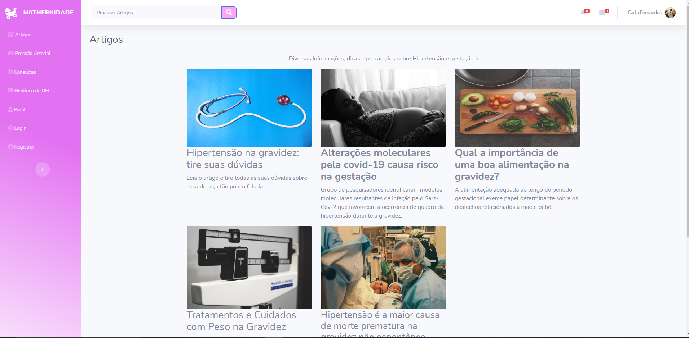

<br><br>
<p align="center">
  

  <h3 align="center">Mothernidade</h3>

  <p align="center">
    Uma interface simples para que gestantes possam se informar sobre Hipertensão Gestacional.
    <br />
    <a href="https://github.com/jv-root/Mothernidade"><strong>Explore the docs »</strong></a>
    <br />
    <br />
    <a href="https://github.com/github_username/repo_name">Demo</a>
    ·
    <a href="https://github.com/jv-root/Mothernidade/issues">Reportar Bug</a>
    ·
    <a href="https://github.com/jv-root/Mothernidade/issues">Request Feature</a>
  </p>
</p>


<details open="open">
  <summary><h2 style="display: inline-block">Conteúdo</h2></summary>
  <ol>
    <li>
      <a href="#about-the-project">Sobre o projeto</a>
      <ul>
        <li><a href="#built-with">Tecnologias</a></li>
      </ul>
    </li>
    <li>
      <a href="#getting-started">Configuração Para Desenvolvimento</a>
      <ul>
        <li><a href="#installation">Instalação</a></li>
      </ul>
    </li>
    <li><a href="#usage">Exemplo de uso</a></li>
    <li><a href="#contributing">Contribuição</a></li>
    <li><a href="#contact">Contato</a></li>
  </ol>
</details>


## Sobre o Projeto
<br>



Projeto desenvolvido como Trabalho de conclusão de curso (TCC) do curso Técnico de Desenvolvimento de Sistemas da instituição Centro Paula Souza (ETEC) com o principal tema abordado o auxílio para Gestantes com Hipertensão e/ou pre-emclâmpsia ou emclâmpsia. Com Base nos 17 Objetivos de Desenvolvimento da ONU para até 2030, mais especificamente no tópico 3 saúde e bem-estar.

## Tecnologias


* []()
* []()
* []()
* []()


## Configuração para Desenvolvimento

Crie uma pasta local e execute os seguintes passos:

### Instalação

1. Clone o repositório
   ```sh
   git clone https://github.com/jv-root/Mothernidade.git
   ```
2. Instale as dependências
   ```sh
   npm install
   ```


## Exemplo de Uso

* Esse site responsivo pode ser usado para consulta de artigos sobre Hipertensão, alimentação durante a gravidez e riscos relacionados. 
* Pode ser usado para a orientação sobre o estado da pressão após medição.
* Guardar registros da pressão arterial como um histórico para posteriormente mostrar ao médico responsável pelo pré-natal.

_Para melhores exemplos, consultar o TCC escrito [Documentação](https://example.com)_


## Contribuição


1. Faça o _fork_ do projeto (<https://github.com/yourname/yourproject/fork>)
2. Crie uma _branch_ para sua modificação (`git checkout -b feature/fooBar`)
3. Faça o _commit_ (`git commit -am 'Add some fooBar'`)
4. _Push_ (`git push origin feature/fooBar`)
5. Crie um novo _Pull Request_


## Contato

João Victor - [@twitter_handle](https://twitter.com/twitter_handle) - email

Project Link: [https://github.com/github_username/repo_name](https://github.com/github_username/repo_name)


